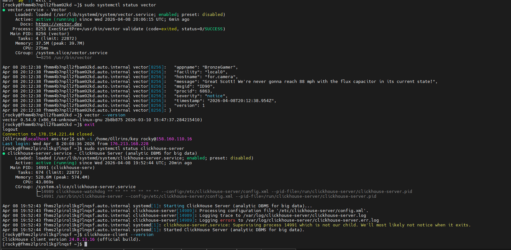
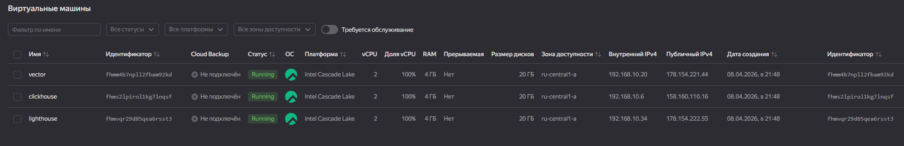
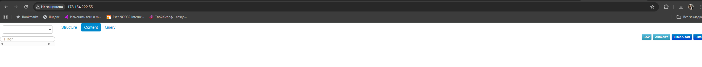
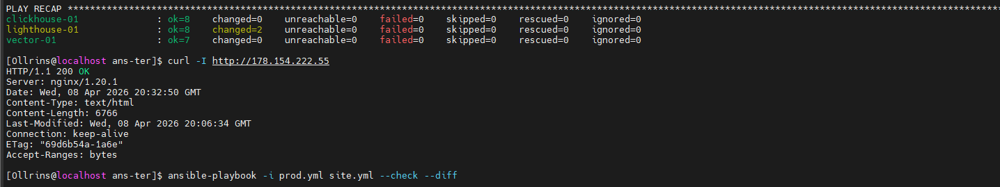
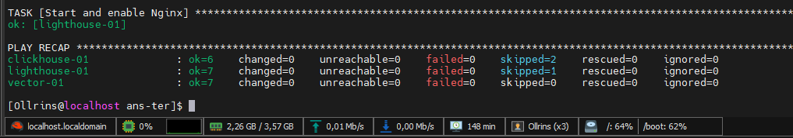

### Домашнее задание к занятию 3 «Использование Ansible»
  <br>
  
<p align="center">
  
  <br>
  <em>Проверка работы Vector и ClickHouse</em>
</p>
<p align="center">
  
  <br>
  <em>Скриншот облака яндекс с адресом</em>
</p>
<p align="center">
  
  <br>
  <em>Проверка работы Lighthouse в браузере</em>
</p>
<p align="center">
  
  <br>
  <em>Проверка работы Lighthouse в консоли</em>
</p>
<p align="center">
  
  <br>
  <em>ansible-playbook -i prod.yml site.yml --diff</em>
</p>

<br>
[Исходный код](https://github.com/Ollrins/Ansible-usage/tree/main/src "Ссылка на GitHub")
<br>

Данный playbook предназначен для автоматической установки и настройки трех сервисов на отдельных хостах в Yandex Cloud:

- **ClickHouse** - колоночная СУБД для аналитики больших данных
- **Vector** - инструмент для сбора, трансформации и маршрутизации логов
- **Lighthouse** - веб-интерфейс для мониторинга (форк от VKCOM)

Playbook автоматически:
- Устанавливает системные зависимости
- Скачивает и устанавливает пакеты
- Настраивает сервисы
- Конфигурирует SELinux (для Lighthouse)
- Запускает и включает сервисы в автозагрузку

#### Структура playbook
site.yml # Главный playbook  <br>
├── ClickHouse # Установка и настройка ClickHouse  <br>
├── Vector # Установка и настройка Vector  <br>
└── Lighthouse # Установка и настройка Lighthouse + Nginx  <br>


#### Требования

- Ansible 2.20 или выше
- Доступ по SSH к целевым хостам
- Rocky Linux 9 на целевых хостах
- Права sudo на целевых хостах

#### Параметры

#### Переменные для ClickHouse

| Переменная | Описание | Значение по умолчанию |
|------------|----------|----------------------|
| `clickhouse_version` | Версия ClickHouse для установки | `24.8.13.16` |

### Переменные для Lighthouse

| Переменная | Описание | Значение по умолчанию |
|------------|----------|----------------------|
| `lighthouse_repo` | URL репозитория Lighthouse | `https://github.com/VKCOM/lighthouse.git` |
| `lighthouse_dir` | Директория установки Lighthouse | `/var/www/lighthouse` |

#### Теги

Playbook поддерживает следующие теги для выборочного выполнения:

| Тег | Описание |
|-----|----------|
| `clickhouse` | Установка и настройка только ClickHouse |
| `vector` | Установка и настройка только Vector |
| `lighthouse` | Установка и настройка только Lighthouse |

#### Использование

##### 1. Подготовка inventory файла

Файл `prod.yml`:

```yaml
all:
  children:
    clickhouse:
      hosts:
        clickhouse-01:
          ansible_host: <IP_АДРЕС_CLICKHOUSE>
          ansible_user: rocky
          ansible_ssh_private_key_file: /path/to/ssh/key
    vector:
      hosts:
        vector-01:
          ansible_host: <IP_АДРЕС_VECTOR>
          ansible_user: rocky
          ansible_ssh_private_key_file: /path/to/ssh/key
    lighthouse:
      hosts:
        lighthouse-01:
          ansible_host: <IP_АДРЕС_LIGHTHOUSE>
          ansible_user: rocky
          ansible_ssh_private_key_file: /path/to/ssh/key
```	  
		  
2. Запуск playbook
```bash
ansible-playbook -i prod.yml site.yml --check
ansible-playbook -i prod.yml site.yml --diff


# Полная установка всех сервисов
ansible-playbook -i prod.yml site.yml

# Установка только ClickHouse
ansible-playbook -i prod.yml site.yml --tags clickhouse

# Установка только Vector
ansible-playbook -i prod.yml site.yml --tags vector

# Установка только Lighthouse
ansible-playbook -i prod.yml site.yml --tags lighthouse
```
3. Проверка изменений (dry-run)
```bash
# Показать что изменится без реального применения
ansible-playbook -i prod.yml site.yml --check --diff
```
Что делает playbook

ClickHouse
- Устанавливает системные зависимости (curl, wget, ca-certificates, libtool, unixODBC)
- Скачивает RPM пакеты ClickHouse версии 24.8.13.16
- Устанавливает пакеты:
- clickhouse-common-static
- clickhouse-client
- clickhouse-server
- Запускает и включает сервис clickhouse-server
- Создает базу данных logs

Vector
- Устанавливает системные зависимости (curl, wget, dnf-plugins-core)
- Добавляет официальный репозиторий Vector через setup.vector.dev
- Устанавливает пакет vector через DNF
- Создает конфигурационный файл /etc/vector/vector.toml из шаблона
- Запускает и включает сервис vector

Lighthouse
- Устанавливает системные зависимости (git, nginx, policycoreutils-python-utils)
- Клонирует репозиторий Lighthouse в /var/www/lighthouse
- Настраивает Nginx с конфигурацией из шаблона
- Настраивает SELinux для доступа Nginx к файлам Lighthouse
- Запускает и включает сервис nginx

Проверка работы

```bash
# Проверка ClickHouse
ssh rocky@<CLICKHOUSE_IP> "clickhouse-client -q 'SELECT version();'"

# Проверка Vector
ssh rocky@<VECTOR_IP> "vector --version"

# Проверка Lighthouse
curl http://<LIGHTHOUSE_IP>
```

